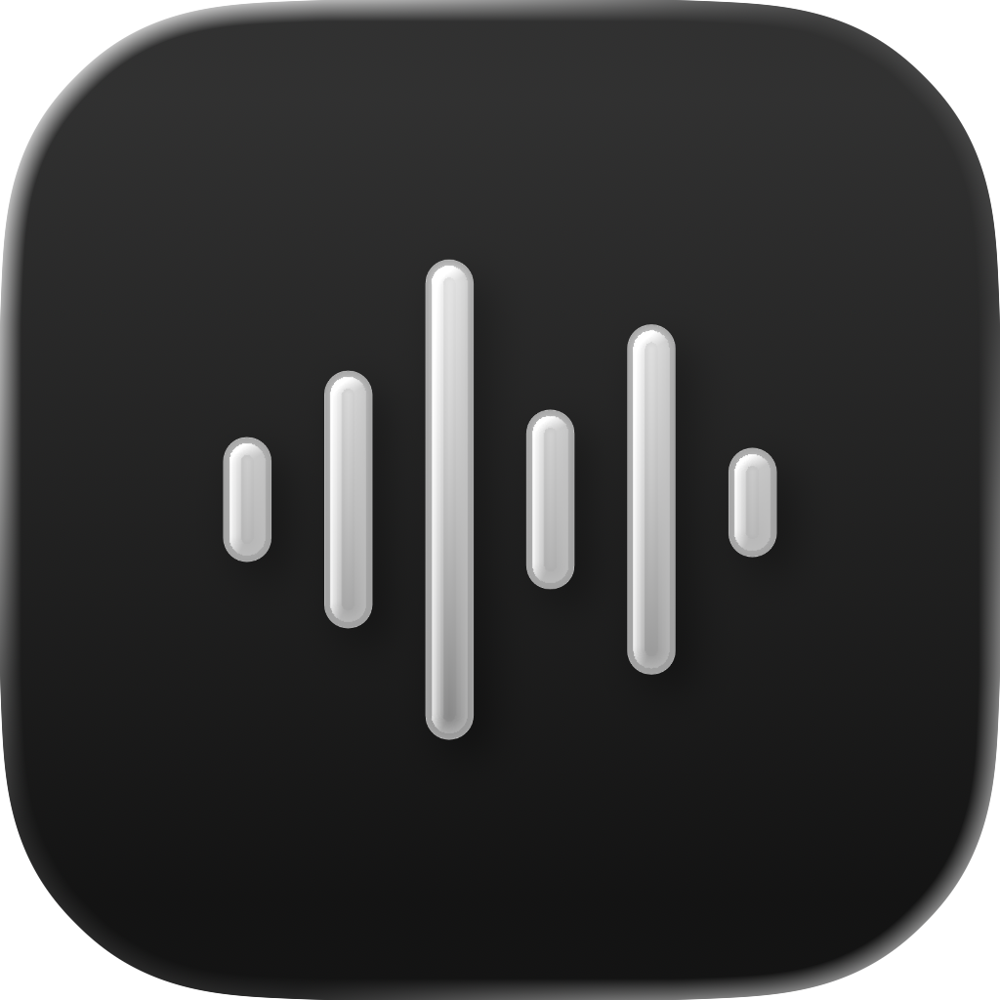
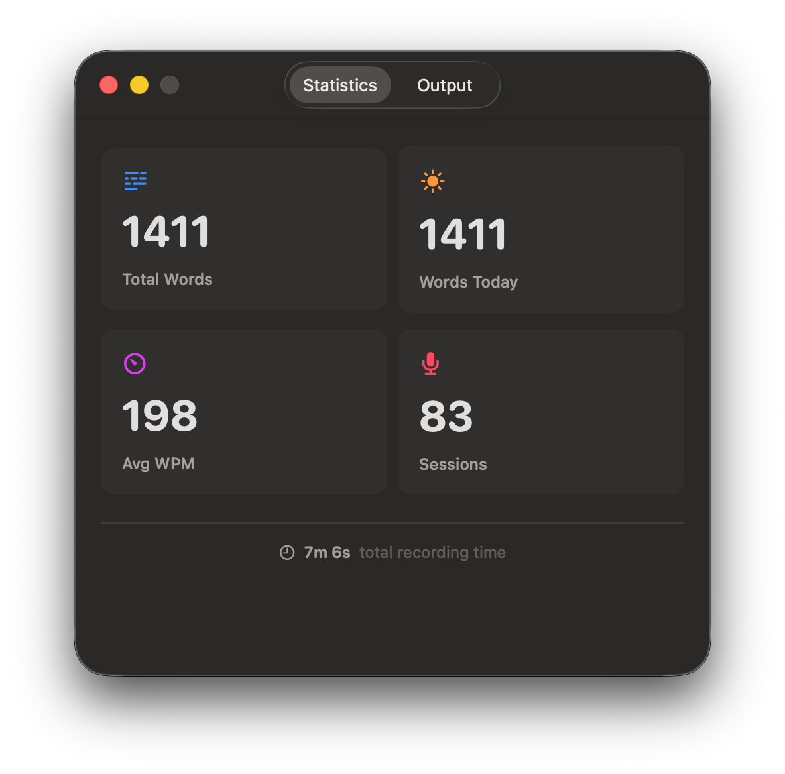
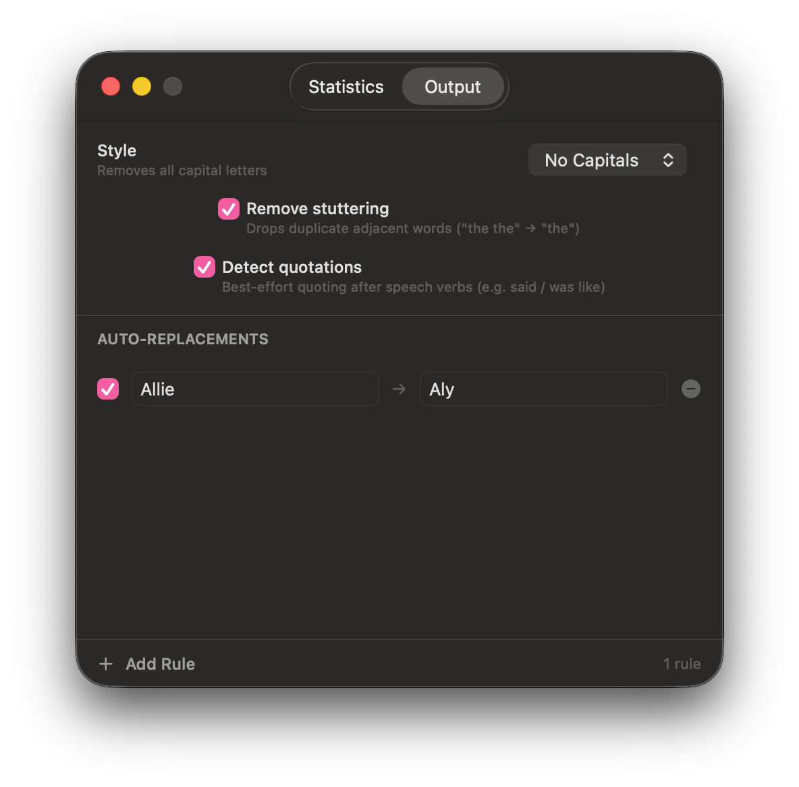

#  Transcript

A beautiful wrapper around macOS ASR in Sonoma. Statistics and ultra-fast transcription, completely local.

## Usage

Hold **Right Option (⌥)** to record. Release to transcribe. The text is copied to your clipboard and pasted automatically.

A floating pill at the bottom of your screen shows recording, processing, and completion states.

  

## Features

- **Fully local** — on-device speech recognition, nothing leaves your Mac
- **Global hotkey** — works in any app, no window switching
- **Auto-paste** — transcribed text is pasted into the active text field
- **Output styles** — Formal, No Capitals, or Casual (drops periods)
- **Stutter removal** — strips duplicate adjacent words automatically
- **Auto-replacements** — custom find-and-replace rules applied after transcription
- **Statistics** — tracks total words, sessions, average WPM, and daily counts
- **Microphone picker** — choose any connected input device

  
  &nbsp;&nbsp;
  

## Requirements

- macOS 26 Tahoe or later
- Accessibility permission (for global hotkey)
- Microphone permission
- Speech Recognition permission
